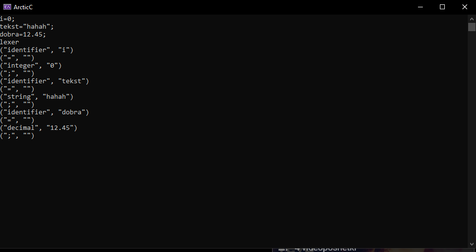
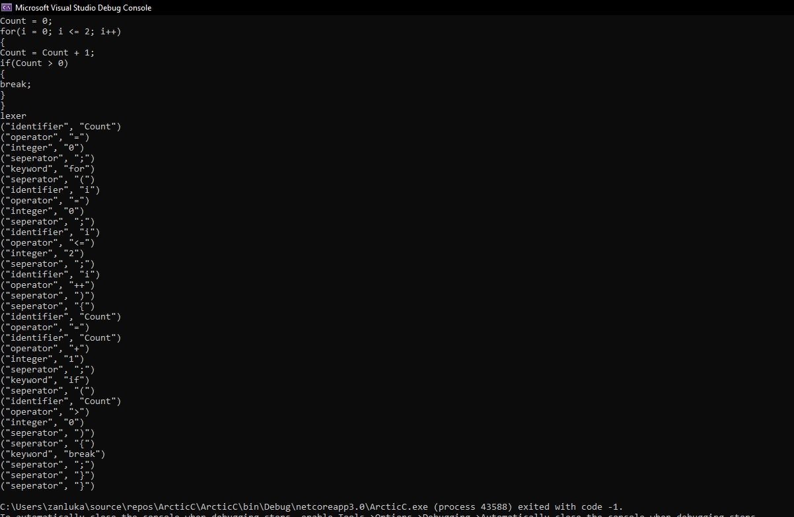

# ArcticC
A simple programming language.  
Please note that this programming lanugage is not working yet!  
(Currently working on lexer & parser)  

<h1>Lexer</h1>
+ Working for variables.  
+ Working for separators.  
+ Working for operators.  
+ Working for keywords (if, else, break, continue, case, switch, for, default and while).  

 

 

